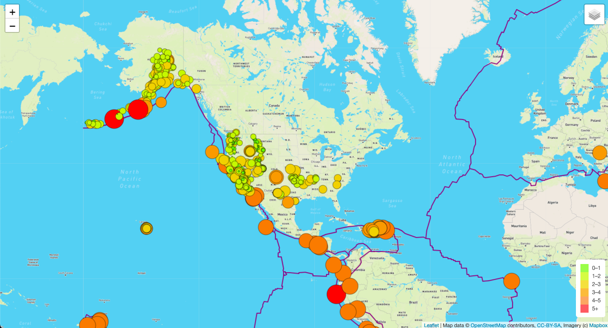
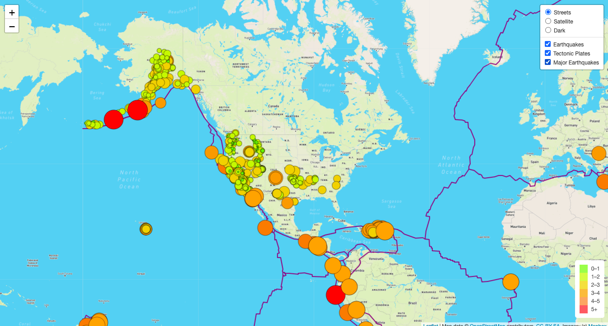
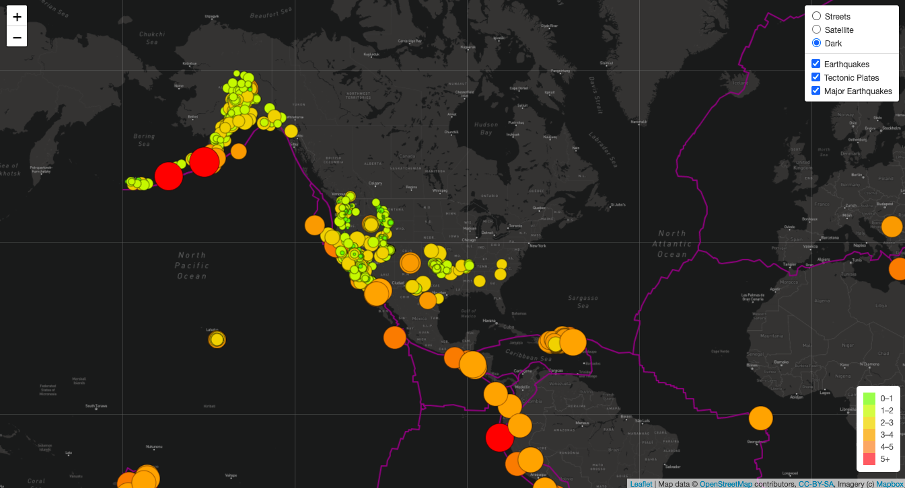

# Mapping_Earthquakes

## Overview
The objective of this project is to gather earthquake GeoJSON data from the USGS API, create and explore interactive maps of earthquakes around the world.
The earthquake data is represented on the maps in relation to the tectonic plates’ location on the earth, and according to each event's magnitude.

## Resources
- Data Sources: [Techtonic Plate Boundaries](https://github.com/fraxen/tectonicplates/blob/master/GeoJSON/PB2002_boundaries.json), [M4.5 Earthquakes](https://earthquake.usgs.gov/earthquakes/feed/v1.0/summary/4.5_week.geojson)
- Tech Used: HTML/CSS, JavaScript, VS Code, Leaflet, D3.js

### Interactive Maps Views

#### Faultlines

#### Major Earthquakes 

#### Additional Map Overlay 
